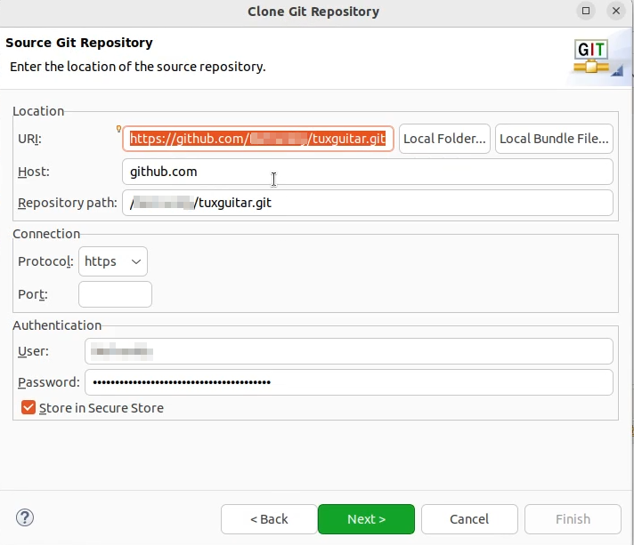
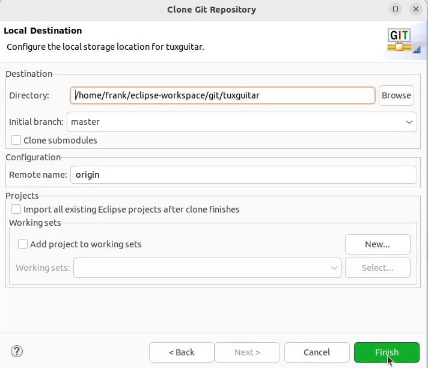
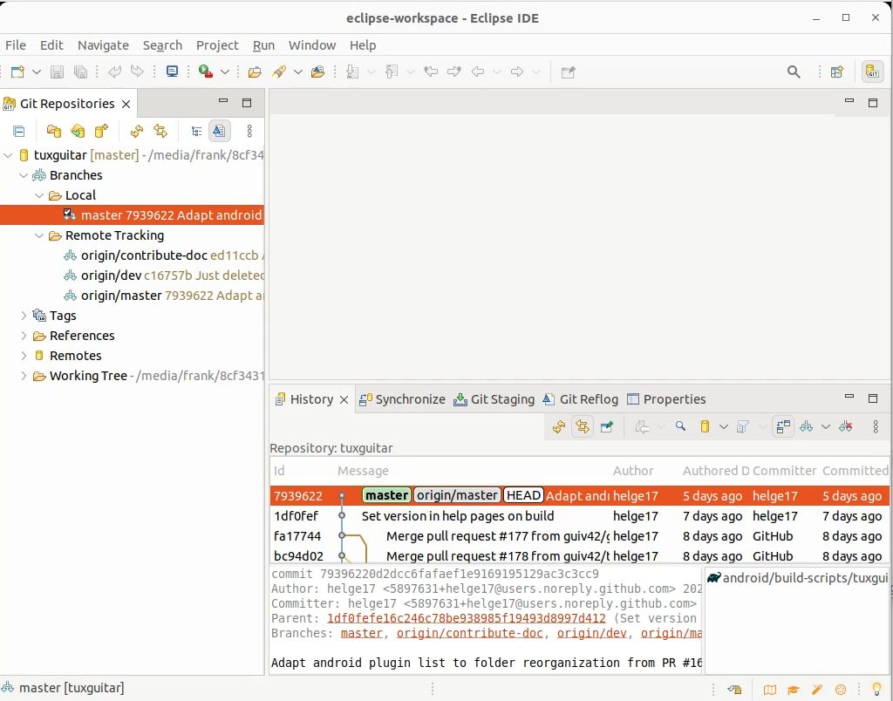
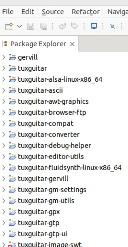

# Contribute
This github repository was made by developers, that had seen that the project, which was originally hosted on sourceforge, was not maintained anymore. The founder of Tuxguitar had not answered any questions and his website that contains information for developers is down.

After some weeks we were able to build tuxguitar for different GUIs and now (end of 2024) we can tell how to setup a SWT project in eclipse. The information shown here possibly will change over the next month, each time when we have found out some new aspects about how to develop. But at the moment it is the best to do it this way.

## Prerequisites

* **General**: To contribute, you need nothing more than to enjoy opensource and do the community a favor. 

* **Developer**: As a developer, you may be missing a function in our software yourself and would like to add it. Or you have discovered a bug and know how to fix it.

* **Writer**: It's always good to have people around who can express themselves well and are able to write easytoread documentation. A warm welcome.

* **Commentators**: You enjoy communicating with others. Then liven up our discussions and collect answers to frequently asked questions. Make first contact with participants of our Forums and keep them happy.

* **Backers**: A warm welcome. If you want the project to last and you are familiar with the financing of such projects, take us by the hand.

## Get in contact

In order to get in contact with other contributors just use the github discussion functionality. 

We will now focus on the **developer** role and show how to easily clone the repository, install eclipses swt, import the project and finally import build and run configuration. Normally you **will not need more the 30 minutes**.

## Setup Eclipse IDE
We think that most of the java developers are familiar with the Eclipse IDE, one of the most used IDEs not just for writing and testing code. It supports many processes around software projects, even writing this documentation in markdown. For information about downloading and installing it see <https://eclipse.org>.
Our examples and screenshots here are from Eclipse Version 2023-12.

### Fork the origin tuxguitar repository
Because normally you do not have the right to push to the origin repository, you must first fork the repository in order to make changes to your forked repository as a fist step. It depends on how you host your own repository to know, what steps to do. This is nothing that's in the context of this documentation. Read the docs of your repository provider.

   
### Make a local copy of the forked repository
We assume, that you have started eclipse and had setup a eclipse workspace. So open the git perspective and click on "Clone a git repository". In the next dialog select "Clone URI" and click next. Fill in the form with the data of your repository. Here you can see how it is setup with mine.



In the next step you will probably only **see the master branch. It has to been checked**. Click next.


As a last step you have to choose where on your local drive the repo should be placed. In my case I created a folder named "git" in my eclipse workspace.



After you finished you will see a percent value telling you how much of downloading files from the repostiory has been done. If this background job has finished, you will see how your local repository is structured. Something like this:



### Import the SWT maven project

In order to build the SWT variant of tuxguitar you have to import the maven project in question. To do so, open the Java perspective and in the menu go to File->Import and choose Maven->Existing Maven Projects. You have to import the swt project you will find in your local git repository, i.e. "..../eclipse-workspace/git/tuxguitar/desktop/build-scripts/tuxguitar-linux-swt-x86_64"   


After you finished and eclipse has done its work you'll see the package explorer containing all the packages needed for a build.



### Install the eclipse swt packages

You are now not fully equipped for building. There are only 2 steps left.

To have all foreign packages in our eclipse workspace we create a folder "externals", download and install the swt package. The process is the same for installing, but here we do it all in the eclipse workspace. First you might have to install maven.
So open a terminal in the eclipse workspace.

```sh
eclipse-workspace$ sudo apt install maven
eclipse-workspace$ mkdir externals
eclipse-workspace$ cd externals
eclipse-workspace$ wget https://archive.eclipse.org/eclipse/downloads/drops4/R-4.13-201909161045/swt-4.13-gtk-linux-x86_64.zip
eclipse-workspace/externals$ mkdir swt-4.13-gtk-linux-x86_64
eclipse-workspace/externals$ cd swt-4.13-gtk-linux-x86_64
eclipse-workspace/externals$ unzip ../swt-4.13-gtk-linux-x86_64.zip
eclipse-workspace/externals$ mvn install:install-file -Dfile=swt.jar -DgroupId=org.eclipse.swt -DartifactId=org.eclipse.swt.gtk.linux.x86_64 -Dpackaging=jar -Dversion=4.13
```
### Import the launch configurations for building, running and debugging
In order to make it easy for you, we stored example launch configurations in the repository. You have to import them. Go to Menu File->Import and select Run/Debug->Launch configuration. Import the configurations located in **eclipse-workspace/git/tuxguitar/development.** You can use the as a starting point. You might need to adjust the them to fullfill your folder structure.

Congratulations. You can now build, run and debug Tuxguitar SWT.


 


