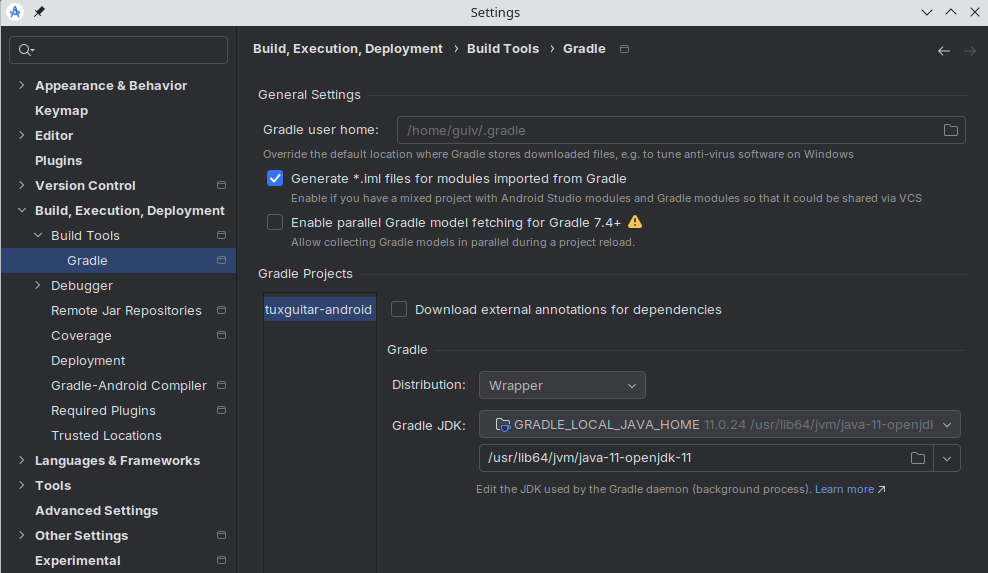
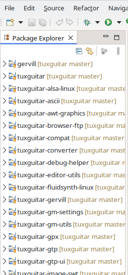
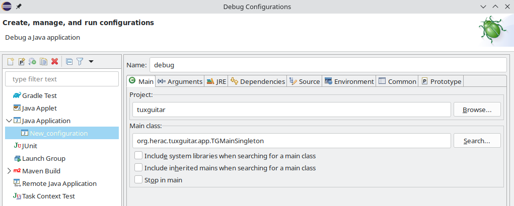
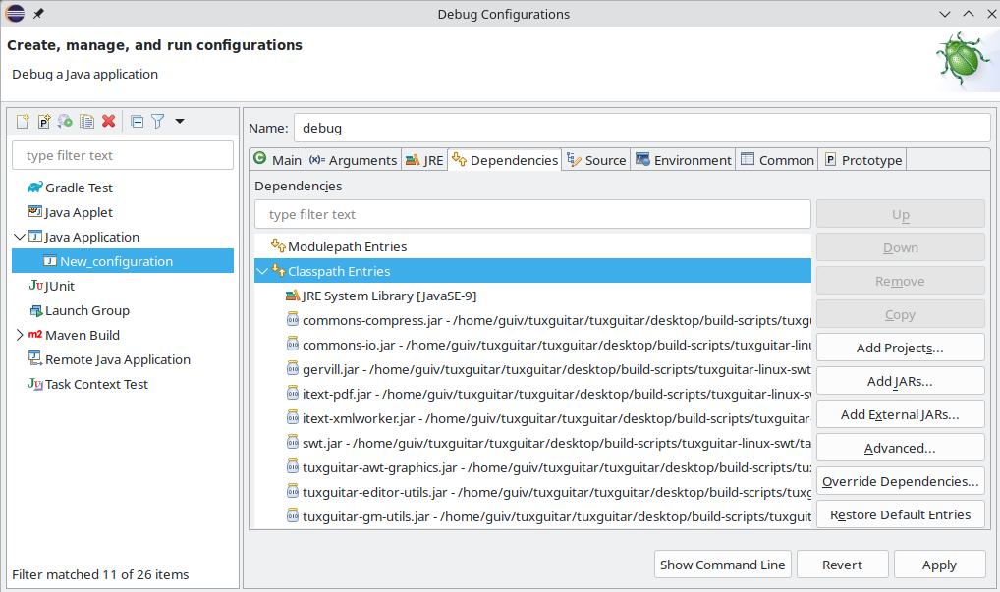

# Contribute

This GitHub repository was made by developers who had seen that the project on SourceForge was no longer being maintained. The founder of TuxGuitar had not answered any questions and his website containing developer information and download links was offline.

With some effort, we were able to build TuxGuitar for different operating systems and now (beginning of 2024) we can tell how to setup the SWT project in Eclipse in a Linux environment. The information shown here is subject to change as development progresses. This is a starting point.
<br>
<br>

## Introduction

* **General**: To contribute, you need nothing more than to enjoy open source and do the community a favor.

* **Developer**: As a developer, there may be features you wish the software had and want to add them yourself. Or you have discovered a bug and know how to fix it.

* **Writer**: It's always good to have people around who can express themselves well and are able to write easy-to-read documentation. A warm welcome.

* **Translator**: Do you speak a language other than English, or several of them? There's always something to be done in this area.

* **Commentator**: Do you enjoy communicating with others? Liven up our discussions and collect answers to frequently asked questions. Make first contact with participants of our discussions and keep them happy.
<br>
<br>

## Get in contact

In order to get in contact with other contributors just use the GitHub discussion functionality.
<br>
<br>

## How to contribute (non-developers)

You do not need to have any development skills to contribute - below are a few examples of what you can provide to the community.

### Test the application

Work-in-progress *snapshots* are published quite frequently, see [releases](https://github.com/helge17/tuxguitar/releases). Try to always use the most recent snapshot, and create an issue if you find a bug. Before creating a new issue, take care that it does not already exist. Make sure to include the following information in the issue's description:

- the version of the app, e.g. "2024-01-01-snapshot";
- the operating system and its version, e.g. "Windows 11", or "Ubuntu 22.04";
- the variant of the app: SWT or JFX for desktop app;
- the detailed sequence of actions leading to the bug;
- a description of both the observed behavior and the behavior you expected.

Don't hesitate to include screenshots or short videos to help understand. If the bug occurs for one specific tablature file, please attach it as a zipped file in the issue's description.

Basically: all information enabling us to reproduce the issue is welcome.

Your work is not over once you have created an issue: stay tuned and check the issue's status regularly, we may have questions for you that need answered before a fix can be implemented.

### Translate app content

TuxGuitar is available in many languages, but yours may be missing. We also regularly add new features and, therefore, new text strings to translate. Finally, not all translations are exhaustive. There's always work to do.

Translation files are available:

- [here](https://github.com/helge17/tuxguitar/tree/master/common/resources/lang) for the main application (desktop and Android);
- there for plugins: [tuner](https://github.com/helge17/tuxguitar/tree/master/desktop/TuxGuitar-tuner/share/lang), [batch file converter](https://github.com/helge17/tuxguitar/tree/master/desktop/TuxGuitar-converter/share/lang), [jack](https://github.com/helge17/tuxguitar/tree/master/desktop/TuxGuitar-jack/share/lang) and [pdf export](https://github.com/helge17/tuxguitar/tree/master/desktop/TuxGuitar-pdf-ui/share/lang).

Other translation files specific to Android are present, these are derived from the files above.

The easiest way to update one translation is probably to open the English "messages.properties" file and the corresponding file for your language side by side. Those files can be edited with any standard text editor. Every line starting with a "#" character will be ignored and the corresponding message will be displayed in English. To translate a string: add the translated text after the "=" sign, remove the leading "# " and you're done.

You do not need to follow all steps described in this document to submit an updated translation. Just use the standard [GitHub process](https://docs.github.com/en/get-started/quickstart/contributing-to-projects).

### Suggest improvements

A feature you would love is currently missing? You can create a dedicated issue. In this case, use **"Feature request"** in the issue's description, and try to provide a precise description of your desired feature. Stay tuned, we might have questions for you before trying to implement something.
Please remember that this project is maintained by volunteers only, so some requests may not be implemented and most will take time. Be patient and polite when making or responding to requests.
<br>
<br>

## How to contribute (developers)

TuxGuitar provides Android and desktop applications:

- files specific to Android application are located in the [android](../android) folder;
- files specific to desktop applications are located in the [desktop](../desktop) folder;
- files common to Android and desktop applications are located in the [common](../common) folder.

### Android application

This section was updated in September 2024. It describes how to import the TuxGuitar project in Android Studio, in a Linux environment:

- download and install Android Studio. This section was written for Android Studio "Koala feature drop 2024.1.2";
- from Android Studio, open project located here: [android/build-scripts/tuxguitar-android](../android/build-scripts/tuxguitar-android);
- in menu File -> Settings, select "Build, Execution, Deployment / Build Tools / Gradle". In the field "Gradle JDK", select "jbr-17".

Settings window should look like this:



Then:

- type OK;
- in menu "File", select "Sync Project with Gradle Files".

Then you should be able to build and run application with dedicated buttons in the toolbar.

### Desktop application

TuxGuitar is available in different flavors:

- platform: FreeBSD, Linux (.tar.gz), Linux (.deb), macOS, Windows (standalone version), Windows (installable version);
- UI framework: SWT, JavaFX.

Note: only the SWT variants are included in the official releases, JavaFX variants support is not guaranteed.

Application is essentially developed in Java, however, some *native modules* can also include parts developed in another language (e.g. C). The application is built using Maven. For detailed build instructions please refer to [install.md](../INSTALL.md) file.

For each {platform, UI framework} couple, one Maven project is defined in a `pom.xml` file. All Maven projects are located in the [desktop/build-scripts](../desktop/build-scripts) folder. Each pom file defines all the successive build steps.

Note: it should be possible to build TuxGuitar also on some other architectures, but only x86_64 architecture is supported in this repo.

### Submit a contribution

If you want to implement one feature request or to fix an issue, mention it explicitly in the issue's discussion, so that others do not try to address it in parallel.
To submit a contribution, follow the GitHub [guidelines](https://docs.github.com/en/get-started/exploring-projects-on-github/contributing-to-a-project#making-a-pull-request) and create a pull request. Take care to `squash` your commits before submitting a pull request, except if there is a good reason not to do so (intermediate development commits have a low added value in the master's history). If your pull request implements or fixes an issue, make this explicit in the pull request's description (e.g. "should fix issue #xxx").

### Setup Eclipse IDE

We will now focus on the **developer** role and show our suggested method to easily clone the repository, install necessary tooling, import the project and finally import, build and run the Linux/SWT configuration. Normally, you **will not need more than 30 minutes**.

This walkthrough assumes that you will be using the Eclipse Development Environment and a Unix-based system. You're welcome to use another environment or OS, but instructions will not be provided.

Eclipse supports many processes around software projects, even writing documentation in markdown. For information about downloading and installing it see <https://eclipse.org>.
Our examples and screenshots here are from Eclipse Version 2023-12.

Important note: this section still needs to be completed. Known limitations:

- this procedure does not enable to build the *native modules* in Eclipse. Therefore, before sending a pull request it is highly recommended to build the application as defined in [install.md](../INSTALL.md), that is with `-P native-modules` option active;
- this procedure does not enable to include the *native modules* and associated plugins in debug configuration.

#### Fork the origin TuxGuitar repository

Because you do not have rights to push to this repository directly, you must first fork this repo to create a space for you to make your edits, then create a pull request once your changes are complete. If your pull request is accepted, it will be merged in a future version of the software. See the [instructions on forking a repository](https://docs.github.com/en/pull-requests/collaborating-with-pull-requests/working-with-forks/fork-a-repo) from GitHub.

#### Make a local copy of the forked repository

We assume, that you have started Eclipse and setup an Eclipse workspace. Open the git perspective and click on "Clone a git repository". In the next dialog select "Clone URI" and click next. Fill in the form with the data of your repository. Here you can see an example setup.


In the next step, you will probably only **see the master branch. It has to been checked**. Click next.


As a last step, you have to choose where on your local drive the repo should be placed. In my case, I created a folder named "git" in my Eclipse workspace.


After you finish you will see a percent value showing the progress of the local copy. Once this background job has finished, you will see the structure of your local repository. Something like this:


#### Import the SWT Maven project

In order to build the SWT variant of TuxGuitar, you have to import the Maven project in question. To do so, open the Java perspective and go to File -> Import and choose Maven -> Existing Maven Projects. You have to import the SWT project you will find in your local git repository, e.g. "..../eclipse-workspace/git/tuxguitar/desktop/build-scripts/tuxguitar-linux-swt".


Once finished, you'll see the package explorer containing all the packages needed for a build.



#### Install the Eclipse SWT packages

To have all foreign packages in your Eclipse workspace, create a folder named "externals" and download/install the SWT package. The process is the same for installing, but here, it's all done in the Eclipse workspace. If you don't already have Maven installed, open the Eclipse workspace terminal.

```sh
eclipse-workspace$ sudo apt install maven
eclipse-workspace$ mkdir externals
eclipse-workspace$ cd externals
eclipse-workspace$ wget https://archive.eclipse.org/eclipse/downloads/drops4/R-4.26-202211231800/swt-4.26-gtk-linux-x86_64.zip
eclipse-workspace/externals$ mkdir swt-4.26-gtk-linux-x86_64
eclipse-workspace/externals$ cd swt-4.26-gtk-linux-x86_64
eclipse-workspace/externals$ unzip ../swt-4.26-gtk-linux-x86_64.zip
eclipse-workspace/externals$ mvn install:install-file -Dfile=swt.jar -DgroupId=org.eclipse.swt -DartifactId=org.eclipse.swt.gtk.linux -Dpackaging=jar -Dversion=4.26
```

#### Define run configuration

Go to Menu Run -> Run Configurations..., right-click on "Maven Build", select "New Configuration" and give your configuration a name.
In the Main tab, Base Directory section, click on "Workspace" and browse to "tuxguitar-linux-swt".
In the Goals field, type `clean verify`:


Then, at the bottom-right click Apply, then Run. After a short delay (a few tens of seconds) you should see "BUILD SUCCESS".

#### Define debug configuration

Note: this section is still work-in-progress. Its objective is to re-create a debug environment as close as possible to the *real* application.
In *real* application, all dependencies are stored in different folders during the build process, as defined by the `pom.xml` file:

- `.jar` files for the different modules - except plugins - are stored in the `lib` folder;
- `.jar` files for plugins are stored in the `share/plugins` folder;
- other dependencies (help files, translations, skins, configuration files, etc.) are stored in subfolders of the `share` folder.

Path to the `lib` folder is provided to the Java environment by a `classpath` argument in the command line. Path to the `share` folder is provided to TuxGuitar by a `-Dtuxguitar.share.path` argument in the command line. The installation folder is also provided by a command line argument: `-Dtuxguitar.home.path`.
The procedure described in this section aims at recreating a similar environment for the debug configuration.

Go to Menu Run -> Debug Configurations..., right-click on "Java Application", select "New Configuration" and give your configuration a name.
In the Main tab, Project section, click on "Browse..." and select "tuxguitar". In the Main class section, click on "Search..." and select "TGMainSingleton - org.herac.tuxguitar.app":



In the "Arguments" tab, "VM arguments" section, type:
```
-Dtuxguitar.share.path="(path to your tuxguitar source folder)/desktop/build-scripts/tuxguitar-linux-swt/target/tuxguitar-9.99-SNAPSHOT-linux-swt/share/"
-Dtuxguitar.home.path=="(path to your tuxguitar source folder)/desktop/build-scripts/tuxguitar-linux-swt/target/tuxguitar-9.99-SNAPSHOT-linux-swt/"
```

Take care to customize these fields considering your path to the TuxGuitar source folder. Example:


Note: take care, in the screenshot above the full content of the "VM arguments" field is not visible (need to scroll down to see `-Dtuxguitar.home.path` parameter).

In the Dependencies tab, Classpath Entries, delete both "tuxguitar" and "Maven Dependencies" items.
Then, click on "Add External JARs...", browse to folder `tuxguitar/desktop/build-scripts/tuxguitar-linux-swt/target/tuxguitar-9.99-SNAPSHOT-linux-swt/lib/`, and select all files. The screenshot below does not show the complete list of jar files (truncated).



Then, at the bottom-right click Apply, then Debug.

Congratulations. You can now build, run and debug TuxGuitar SWT.
