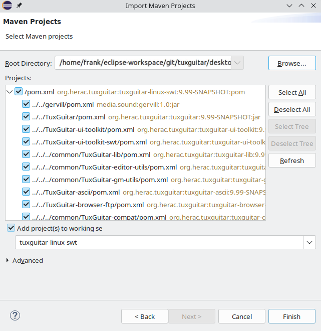

# Contribute
This github repository was made by developers who had seen that the project on sourceforge was no longer being maintained.  The founder of Tuxguitar had not answered any questions and his website containing developer information and download links was offline.

With some effort, we were able to build tuxguitar for different operating systems and now (beginning of 2024) we can tell how to setup the SWT project in Eclipse in a Linux environment.  The information shown here is subject to change as development progresses.  This is a starting point.
<br>
<br>

## Introduction

* **General**: To contribute, you need nothing more than to enjoy opensource and do the community a favor. 

* **Developer**: As a developer, there may be features you wish the software had and want to add them yourself.  Or you have discovered a bug and know how to fix it.

* **Writer**: It's always good to have people around who can express themselves well and are able to write easy-to-read documentation.  A warm welcome.

* **Translator**: You speak a language other than English, or several of them?  There's always something to be done in this area.

* **Commentator**: Do you enjoy communicating with others?  Liven up our discussions and collect answers to frequently asked questions.  Make first contact with participants of our discussions and keep them happy.
<br>
<br>

## Get in contact

In order to get in contact with other contributors just use the github discussion functionality. 
<br>
<br>

## How to contribute (non-developers)
You do no need to have any development skills to contribute - below are a few examples of what you can provide to the community.


### Test the application
Work-in-progress *snapshots* are published quite frequently, see [releases](https://github.com/helge17/tuxguitar/releases).  Try to always use the most recent snapshot, and create an issue if you find a bug.  Before creating a new issue, take care that it does not already exist.  Make sure to include the following information in issue's description:

- the version of the app, e.g. "2024-01-01-snapshot"
- the operating system and its version, e.g. "Windows 11", or "Ubuntu 22.04"
- the variant of the app: SWT or JFX for desktop app
- the detailed sequence of actions leading to the bug
- a description of both the observed behavior and the behavior you expected.

Don't hesitate to include screenshots or short videos to help understanding.  If the bug occurs for one specific tablature file, please attach it as a zipped file in the issue's description.<br>

Basically: all information enabling us to reproduce the issue is welcome.<br>

Your work is not over once you have created an issue: stay tuned and check the issue's status regularly, we may have questions for you that need answered before a fix can be implemented.

### Translate app content
TuxGuitar is available in many languages, but yours may be missing.  We also regularly add new features and, therefore, new text strings to translate.  Finally, not all translations are exhaustive.  There's always work to do.

Translation files are available:

- [here](https://github.com/helge17/tuxguitar/tree/master/desktop/TuxGuitar/share/lang) for main application
- [here](https://github.com/helge17/tuxguitar/tree/master/desktop/TuxGuitar-tuner/share/lang), [here](https://github.com/helge17/tuxguitar/tree/master/desktop/TuxGuitar-converter/share/lang) and [here](https://github.com/helge17/tuxguitar/tree/master/desktop/TuxGuitar-jack/share/lang) for plugins

Translation files for the Android application are derived from the files above.

The easiest way to update one translation is probably to open the English "messages.properties" file and the corresponding file for your language side by side.  Those files can be edited with any standard text editor.  Every line starting with a "#" character will be ignored and corresponding message will be displayed in English.  To translate a string: add the translated text after the "=" sign, remove the leading "# " and you're done.

You do not need to follow all steps described in this document to submit an updated translation. Just use the standard [github process](https://docs.github.com/en/get-started/quickstart/contributing-to-projects).<br>

### Suggest improvements
A feature you would really love is currently missing?  You can create a dedicated issue.  In this case, use **"Feature request"** in the issue's description, and try to provide a precise description of your desired feature.  Stay tuned, we might have questions for you before trying to implement something. 
Please remember that this project is maintained by volunteers only, so some requests may not be implemented and most will take time.  Be patient and polite when making or responding to requests.
<br>
<br>

## How to contribute (developers)
TuxGuitar provides Android and desktop applications.

- files specific to Android application are located in [android](../android) folder
- files specific to desktop applications are located in [desktop](../desktop) folder
- files common to Android and desktop applications are located in [common](../common) folder.

### Android application
TODO: this section needs to be completed.
Android project can be opened with Android studio. It is located here: [android/build-scripts/tuxguitar-android](../android/build-scripts/tuxguitar-android).

### Desktop application
TuxGuitar is available in different flavors:

- platform: FreeBSD, Linux (.tar.gz), Linux (.deb), MacOS, Windows (standalone version), Windows (installable version)
- ui framework: SWT, JavaFX

Note: only the SWT variants are included in the official releases, JavaFX variants support is not guaranteed.

Application is essentially developed in Java, however some *native modules* can also include parts developed in another language (e.g. C). Application is built using Maven. For detailed build instructions please refer to [install.md](../INSTALL.md) file.

For each {platform, ui framework} couple, one Maven project is defined in a `pom.xml` file. All Maven projects are located in [desktop/build-scripts](../desktop/build-scripts) folder. Each pom file defines all the successive build steps.

Note: only x86_64 architecture is supported in this repo.

### Setup Eclipse IDE

We will now focus on the **developer** role and show our suggested method to easily clone the repository, install necessary tooling, import the project and finally import, build and run the Linux/SWT configuration.  Normally, you **will not need more than 30 minutes**.

This walkthrough assumes that you will be using the Eclipse Development Environment and a Unix based system.  You're welcome to use another environment or OS, but instructions will not be provided.

Eclipse supports many processes around software projects, even writing documentation in markdown.  For information about downloading and installing it see <https://eclipse.org>.
Our examples and screenshots here are from Eclipse Version 2023-12.

*Important note*: this section still needs to be completed. Known limitations:

- this procedure does not enable to build the *native modules* in Eclipse. Therefore, before sending a pull request it is highly recommended to build the application as defined in [install.md](../INSTALL.md), that is with `-P native-modules` option active.
- ~~this procedure does not enable to include TuxGuitar plugins in debug configuration~~

To get the enable the plugins in debug configuration make sure to set the `Working directory` in the `Run` configuration, `Arguments` tab to `other`, "${workspace_loc}/git/tuxguitar/desktop/build-scripts/tuxguitar-linux-swt-x86_64/target/tuxguitar-SNAPSHOT-linux-swt-x86_64". To make debugging work, add "gm-settings-SNAPSHOT.jar" and "gm-utils-SNAPSHOT.jar to the `dependencies` tab of the `Run` configuration.


#### Fork the origin tuxguitar repository
Because you do not have rights to push to this repository directly, you must first fork this repo to create a space for you to make your edits, then create a pull request once your changes are complete.  If your pull request is accepted, it will be merged in a future version of the software.  See the [instructions on forking a repository](https://docs.github.com/en/pull-requests/collaborating-with-pull-requests/working-with-forks/fork-a-repo) from GitHub.

   
#### Make a local copy of the forked repository
We assume, that you have started Eclipse and setup an Eclipse workspace.  Open the git perspective and click on "Clone a git repository".  In the next dialog select "Clone URI" and click next.  Fill in the form with the data of your repository.  Here you can see an example setup.


In the next step you will probably only **see the master branch. It has to been checked**. Click next.


As a last step you have to choose where on your local drive the repo should be placed. In my case, I created a folder named <a name="git_folder_name"></a> "git" in my Eclipse workspace.


After you finished you will see a percent value showing the progress of the local copy.  Once this background job has finished, you will see the structure of your local repository. Something like this:


#### Import the SWT Maven project

In order to build the SWT variant of TuxGuitar, you have to import the maven project in question.  To do so, open the Java perspective and go to File->Import and choose Maven->Existing Maven Projects. You have to import the swt project you will find in your local git repository, e.g. "..../eclipse-workspace/git/tuxguitar/desktop/build-scripts/tuxguitar-linux-swt-x86_64"   



Once finished, you'll see the package explorer containing all the packages needed for a build.


#### Install the Eclipse SWT packages 

To have all foreign packages in your Eclipse workspace, create a folder named "externals" and download/install the SWT package.  The process is the same for installing, but here, it's all done in the Eclipse workspace.  If you don't already have Maven installed, open the Eclipse workspace terminal.

```sh
eclipse-workspace$ sudo apt install maven
eclipse-workspace$ mkdir externals
eclipse-workspace$ cd externals
eclipse-workspace$ wget https://archive.eclipse.org/eclipse/downloads/drops4/R-4.13-201909161045/swt-4.13-gtk-linux-x86_64.zip
eclipse-workspace/externals$ mkdir swt-4.13-gtk-linux-x86_64
eclipse-workspace/externals$ cd swt-4.13-gtk-linux-x86_64
eclipse-workspace/externals$ unzip ../swt-4.13-gtk-linux-x86_64.zip
eclipse-workspace/externals$ mvn install:install-file -Dfile=swt.jar -DgroupId=org.eclipse.swt -DartifactId=org.eclipse.swt.gtk.linux.x86_64 -Dpackaging=jar -Dversion=4.13
```
#### Import the launch configurations for building, running and debugging
In order to make it easy for you, we stored example launch configurations in the repository.  To import them, go to Menu File->Import and select Run/Debug->Launch configuration.  Import the configurations located in **eclipse-workspace/git/tuxguitar/development.** You can use them as a starting point.  You might need to adjust them to fullfill your folder structure.

If you did not use "git" as name in the [Make a local copy of the forked repository](#git_folder_name) step, the `Run/Debug` configuration needs to be adjusted accordingly. The change for the "Run" configuration can be found in the `Arguments` tab of the run configuration, under `Working directory`. The change of the `Maven Build` can be found in the `Main` tab, `Base directory`.

Congratulations.  You can now build, run and debug Tuxguitar SWT.
