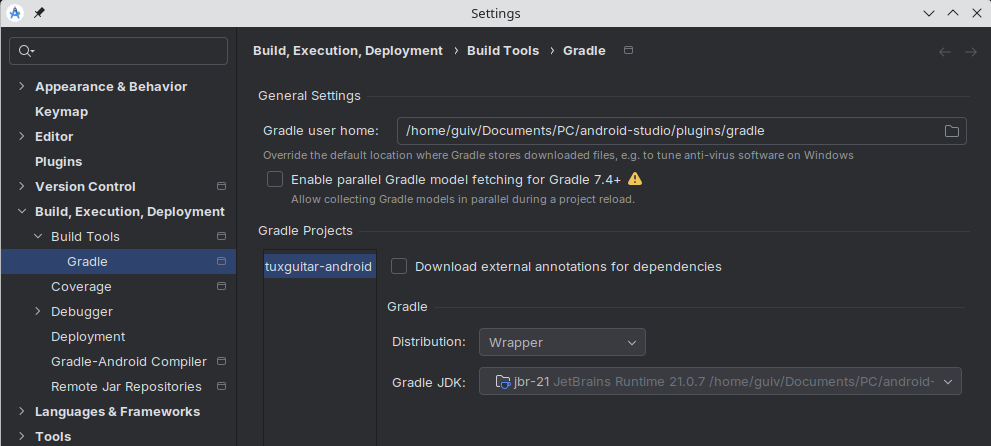
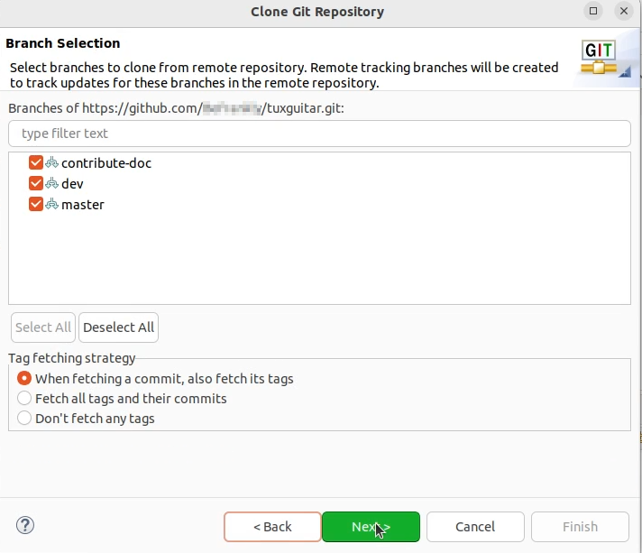
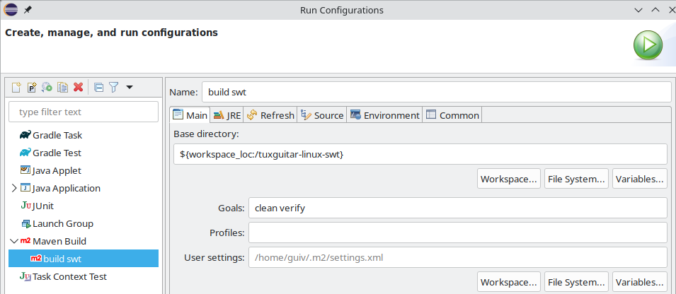
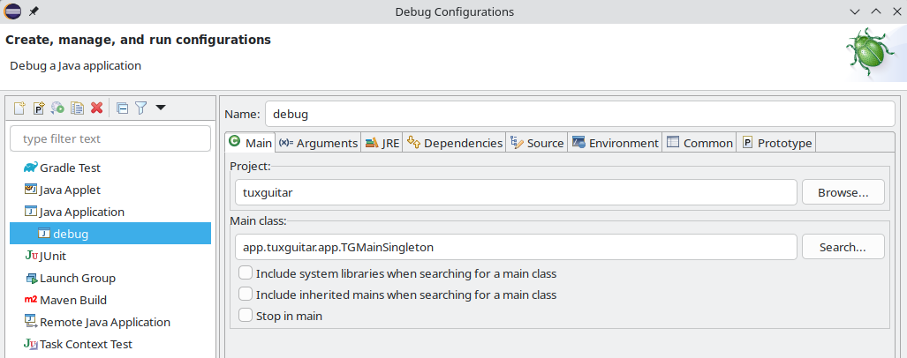
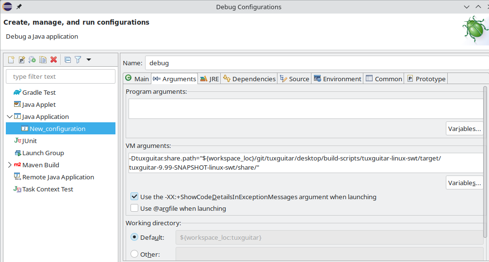

# Setting up a development environment

Instructions to build TuxGuitar from source are detailed in [INSTALL](INSTALL.md). This document suggests methods to configure AndroidStudio and Eclipse IDEs.
You are of course free to use other IDEs, but we cannot provide support for configuration in this case.

## Android application

This section was updated in September 2025. It describes how to import the TuxGuitar project in Android Studio, in a Linux environment:

- download and install Android Studio. This section was written for Android Studio "Narwhal 3 Feature Drop | 2025.1.3";
- from Android Studio, open project located here: [android/build-scripts/tuxguitar-android](../android/build-scripts/tuxguitar-android);
- in menu File -> Settings, select "Build, Execution, Deployment / Build Tools / Gradle". In the field "Gradle JDK", select "jbr-21".

Settings window should look like this:



Then:

- type OK;
- in menu "File", select "Sync Project with Gradle Files".

Then you should be able to build and run application with dedicated buttons in the toolbar.


## Setup Eclipse IDE

This sections shows our suggested method to easily clone the repository, install necessary tooling, import the project and finally import, build and run the Linux/SWT configuration. Normally, you **will not need more than 30 minutes**.

Important note: this section still needs to be completed. Known limitations:

- this procedure does not enable to build the *native modules* in Eclipse. Therefore, before sending a pull request it is highly recommended to build the application as defined in [INSTALL.md](../INSTALL.md), that is with `-P native-modules` option active;
- this procedure does not enable to include the *native modules* and associated plugins in debug configuration.

### Fork the origin TuxGuitar repository

Because you do not have rights to push to this repository directly, you must first fork this repo to create a space for you to make your edits, then create a pull request once your changes are complete. If your pull request is accepted, it will be merged in a future version of the software. See the [instructions on forking a repository](https://docs.github.com/en/pull-requests/collaborating-with-pull-requests/working-with-forks/fork-a-repo) from GitHub.

### Make a local copy of the forked repository

We assume, that you have started Eclipse and setup an Eclipse workspace. Open the git perspective and click on "Clone a git repository". In the next dialog select "Clone URI" and click next. Fill in the form with the data of your repository. Here you can see an example setup.


In the next step, you will probably only **see the master branch. It has to been checked**. Click next.



As a last step, you have to choose where on your local drive the repo should be placed. In my case, I created a folder named "git" in my Eclipse workspace. Make sure the absolute path to your project folder only contains ascii characters (no accented characters, etc.), else the unit tests will fail at build stage.


After you finish you will see a percent value showing the progress of the local copy. Once this background job has finished, you will see the structure of your local repository. Something like this:


### Import the SWT Maven project

In order to build the SWT variant of TuxGuitar, you have to import the Maven project in question. To do so, open the Java perspective and go to File -> Import and choose Maven -> Existing Maven Projects. You have to import the SWT project you will find in your local git repository, e.g. "..../eclipse-workspace/git/tuxguitar/desktop/build-scripts/tuxguitar-linux-swt".


Once finished, you'll see the package explorer containing all the packages needed for a build.


#### Install the Eclipse SWT packages

To have all foreign packages in your Eclipse workspace, create a folder named "externals" and download/install the SWT package. The process is the same for installing, but here, it's all done in the Eclipse workspace. If you don't already have Maven installed, open the Eclipse workspace terminal.

```sh
eclipse-workspace$ sudo apt install maven
eclipse-workspace$ mkdir externals
eclipse-workspace$ cd externals
eclipse-workspace$ wget https://archive.eclipse.org/eclipse/downloads/drops4/R-4.36-202505281830/swt-4.36-gtk-linux-x86_64.zip
eclipse-workspace/externals$ mkdir swt-4.36-gtk-linux-x86_64
eclipse-workspace/externals$ cd swt-4.36-gtk-linux-x86_64
eclipse-workspace/externals$ unzip ../swt-4.36-gtk-linux-x86_64.zip
eclipse-workspace/externals$ mvn install:install-file -Dfile=swt.jar -DgroupId=org.eclipse.swt -DartifactId=org.eclipse.swt.gtk.linux -Dpackaging=jar -Dversion=4.36
```

### Define run configuration

Go to Menu Run -> Run Configurations..., right-click on "Maven Build", select "New Configuration" and give your configuration a name.
In the Main tab, Base Directory section, click on "Workspace" and browse to "tuxguitar-linux-swt".
In the Goals field, type `clean verify`:



Then, at the bottom-right click Apply, then Run. After a short delay (a few tens of seconds) you should see "BUILD SUCCESS".

### Define debug configuration

Note: this section is still work-in-progress. Its objective is to re-create a debug environment as close as possible to the *real* application.
In *real* application, all dependencies are stored in different folders during the build process, as defined by the `pom.xml` file:

- `.jar` files for the different modules - except plugins - are stored in the `lib` folder;
- `.jar` files for plugins are stored in the `share/plugins` folder;
- other dependencies (help files, translations, skins, configuration files, etc.) are stored in subfolders of the `share` folder.

Path to the `lib` folder is provided to the Java environment by a `classpath` argument in the command line. Path to the `share` folder is provided to TuxGuitar by a `-Dtuxguitar.share.path` argument in the command line. The installation folder is also provided by a command line argument: `-Dtuxguitar.home.path`.
The procedure described in this section aims at recreating a similar environment for the debug configuration.

Go to Menu Run -> Debug Configurations..., right-click on "Java Application", select "New Configuration" and give your configuration a name.
In the Main tab, Project section, click on "Browse..." and select "tuxguitar". In the Main class section, click on "Search..." and select "TGMainSingleton - app.tuxguitar.app":



In the "Arguments" tab, "VM arguments" section, type:
```
-Dtuxguitar.share.path="(path to your tuxguitar source folder)/desktop/build-scripts/tuxguitar-linux-swt/target/tuxguitar-9.99-SNAPSHOT-linux-swt/share/"
-Dtuxguitar.home.path="(path to your tuxguitar source folder)/desktop/build-scripts/tuxguitar-linux-swt/target/tuxguitar-9.99-SNAPSHOT-linux-swt/"
```

Take care to customize these fields considering your path to the TuxGuitar source folder. Example:



Note: take care, in the screenshot above the full content of the "VM arguments" field is not visible (need to scroll down to see `-Dtuxguitar.home.path` parameter).

In the Dependencies tab, Classpath Entries, delete both "tuxguitar" and "Maven Dependencies" items.
Then, click on "Add External JARs...", browse to folder `tuxguitar/desktop/build-scripts/tuxguitar-linux-swt/target/tuxguitar-9.99-SNAPSHOT-linux-swt/lib/`, and select all files. The screenshot below does not show the complete list of jar files (truncated).


Then, at the bottom-right click Apply, then Debug.

Congratulations. You can now build, run and debug TuxGuitar SWT.

### Import formatting configuration

When writing this documentation, formatting of java files in TuxGuitar is *very* heterogeneous. For better code readability, it is recommended to apply the same formatting rules everywhere:

- in Eclipse, click menu "Window -> Preferences", then on the left panel select "Java/Code style/Formatter"
- import [formatting style file](../misc/tuxguitar_formatting.xml)
- click "Apply and close"

Whenever you create a new java file, auto-format it (use `Ctrl + Shift + F` shortcut).

Whenever you want to *modify* an existing file, take care that this re-formatting operation can modify the file quite heavily. In this case, please create a dedicated commit when you apply this format, independently from other modifications. Objective is to separate commits with functional modifications from commits with style modifications only, or else code review will become a nightmare.

